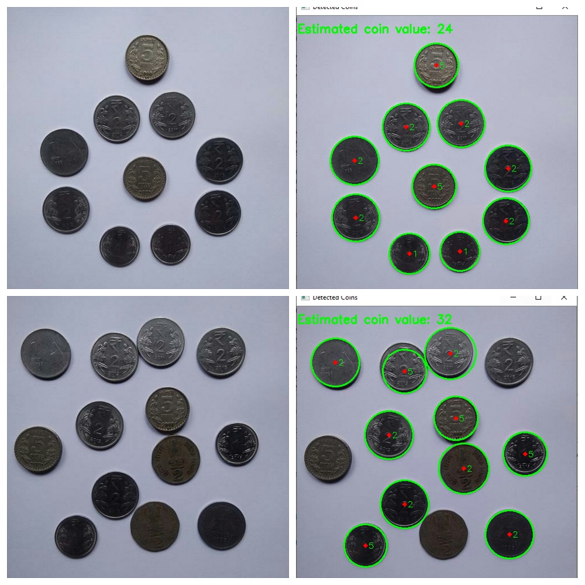

# Image_Segmentation-Python

Estimating coin values using Image Segmentation in Python. Image Segementation is one of the hot areas in Computer Vision, and this is a small replication of how it can be used to estimate the coin vales.

I had so much fun doing this mini-project, and also got to learn many new things. Also there's a bonus program at the very end of the file. 
Feel free to play with it and do reach out what you make out of it. Also star if you like it, that motivates me. :) 

